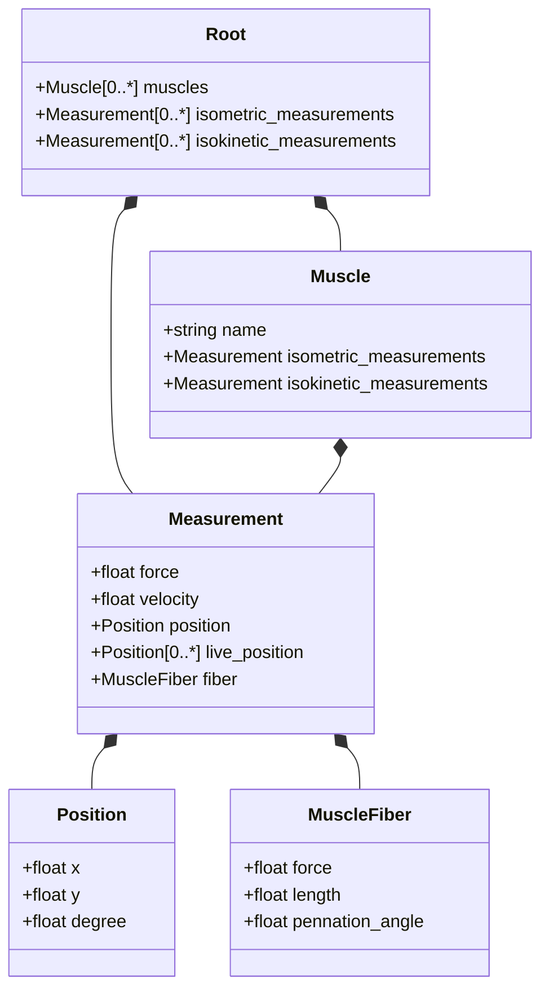

```mermaid
classDiagram
    Root *-- Muscle
    Root *-- Measurement
    Muscle *-- Measurement
    Measurement *-- Position
    Measurement *-- MuscleFiber
    
    class Root {
        +Muscle[0..*] muscles
        +Measurement[0..*] isometric_measurements
        +Measurement[0..*] isokinetic_measurements
    }
    
    class Muscle {
        +string name
        +Measurement isometric_measurements
        +Measurement isokinetic_measurements
    }
    
    class Measurement {
        +float force
        +float velocity
        +Position position
        +Position[0..*] live_position
        +MuscleFiber fiber
    }
    
    class Position {
        +float x
        +float y
        +float degree
    }
    
    class MuscleFiber {
        +float force
        +float length
        +float pennation_angle
    }
    
```